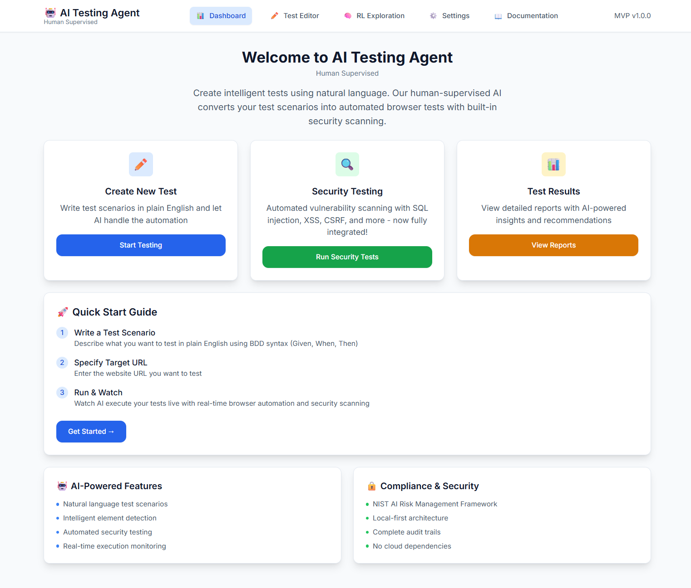
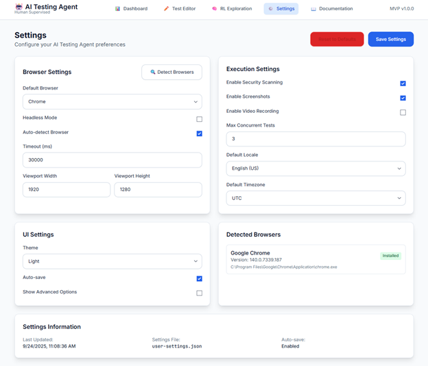
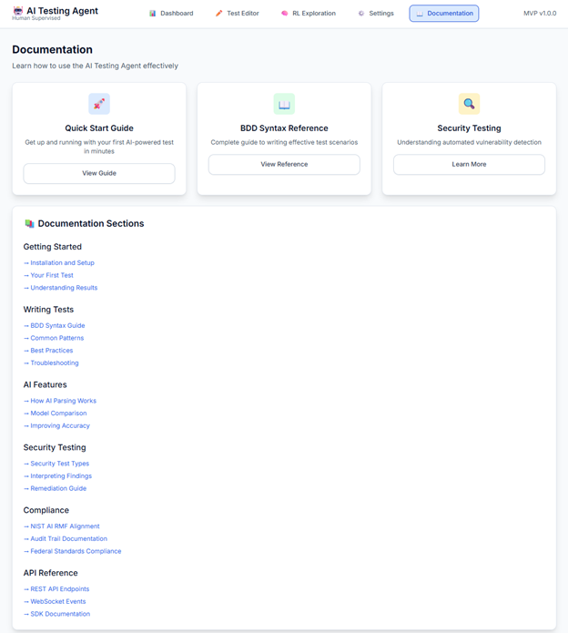

# AI Testing Agent

An automated web testing platform that converts natural language test scenarios into executable browser tests with AI assistance.

## What It Does

The AI Testing Agent automates web application testing by:
- Converting plain English test scenarios to automated browser tests
- Performing intelligent web exploration using reinforcement learning
- Running security vulnerability scans during test execution
- Providing real-time test monitoring and detailed reports

## Screenshots

### Dashboard Overview


### Test Scenario Editor


### Web Exploration


### Exploration Reports


### Report Details


### Settings Configuration


### User Guide


## Run Instructions

### Prerequisites
- Node.js 18+
- Chrome browser
- OpenAI API key

### Quick Start

1. **Clone the repository**
   ```bash
   git clone <repository-url>
   cd ai-testing-agent
   ```

2. **Install dependencies**
   ```bash
   npm run install:all
   ```
   Or manually:
   ```bash
   cd backend && npm install
   cd ../frontend && npm install
   ```

3. **Configure environment**

   Create `backend/.env` file:
   ```env
   PORT=15000
   OPENAI_API_KEY=your_openai_api_key_here
   ANTHROPIC_API_KEY=your_anthropic_api_key_here
   ```

4. **Run the application**

   **Windows:**
   ```bash
   start.bat
   ```

   **Linux/Mac:**
   ```bash
   ./start.sh
   ```

   **Or manually:**
   ```bash
   # Terminal 1 - Backend
   cd backend
   npm run dev

   # Terminal 2 - Frontend
   cd frontend
   npm start
   ```

5. **Access the application**
   - Frontend: http://localhost:15001
   - Backend API: http://localhost:15000
   - Health Check: http://localhost:15000/api/health

### Troubleshooting

If ports are already in use, you can change them in:
- Backend: `backend/.env` (PORT variable)
- Frontend: `frontend/.env` (PORT variable)

### Stop the Application

- Close the terminal windows running the servers
- Or press `Ctrl+C` in each terminal

## License

MIT